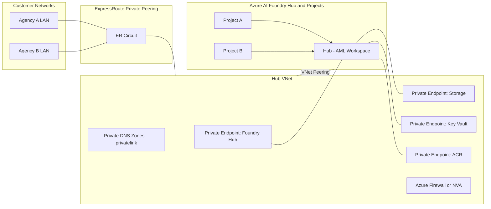

# Azure AI Foundry (Hub Model) – Service-Provider Architecture with ExpressRoute & Private Endpoints

   

This repository documents a **secure, multi-customer architecture** for Azure AI Foundry using the **Hub Model**, integrated with **ExpressRoute**, **Private Endpoints**, and **Private DNS**.

---

## Architecture Diagram (Mermaid)

