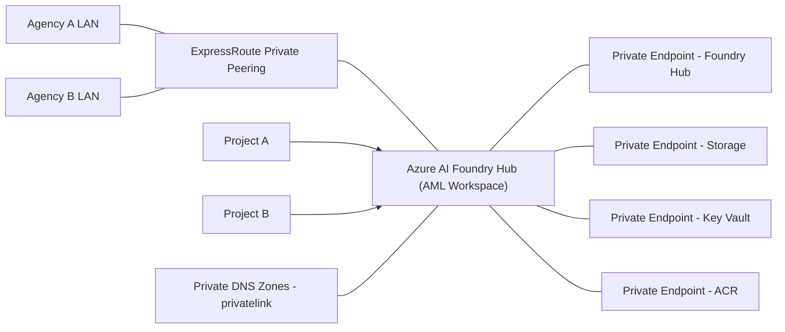

# Azure AI Foundry (Hub Model) – Service-Provider Architecture with ExpressRoute & Private Endpoints

[](LICENSE)   

This repository documents a **secure, multi-customer architecture** for Azure AI Foundry using the **Hub Model**, integrated with **ExpressRoute**, **Private Endpoints**, and **Private DNS**. It’s designed for **service providers** hosting multiple customer projects within the same Azure tenant.

---

## 🧭 Key Concepts

- **Hub (Azure ML workspace–backed):** A central landing zone for Azure AI Foundry that provides shared resources (Storage, Key Vault, Container Registry) and centralized governance/networking.  
  - Docs: *What is Azure AI Foundry?* → <https://learn.microsoft.com/azure/ai-foundry/what-is-azure-ai-foundry>  
  - *AI resources (hubs & projects)* → <https://learn.microsoft.com/azure/ai-foundry/concepts/ai-resources>

- **Project:** A workspace under a Hub where teams build and operate AI apps (agents, prompt flows, evaluations, deployments).  
  - Docs: *Projects in Azure AI Foundry* → <https://learn.microsoft.com/azure/ai-foundry/concepts/projects>

- **Default resources:** When you create a Hub, Azure provisions a **Storage Account**, **Key Vault**, and **Azure Container Registry (ACR)** that you can secure with Private Endpoints.  
  - Hub + default resources and networking → <https://learn.microsoft.com/azure/ai-foundry/how-to/hub-configure-private-link>

---

## 🧩 Architecture Diagram (Mermaid – simplified for GitHub parser)



---

## 🔒 Networking & Private Link

- **Goal:** Ensure all data-plane access to the Hub and its default resources flows **privately** over ExpressRoute via **Private Endpoints** with **Public network access disabled** after validation.
- **Docs:**  
  - Hub Private Link (end-to-end) → <https://learn.microsoft.com/azure/ai-foundry/how-to/hub-configure-private-link>  
  - Project Private Link (non-hub model) → <https://learn.microsoft.com/azure/ai-foundry/how-to/configure-private-link>  
  - Baseline landing zone for Azure AI Foundry → <https://learn.microsoft.com/azure/architecture/ai-ml/architecture/baseline-azure-ai-foundry-landing-zone>  
  - ExpressRoute + Private Link FAQ → <https://learn.microsoft.com/azure/expressroute/expressroute-faq#can-i-access-azure-paas-services-over-an-expressroute-connection>  
  - Private DNS zone guidance → <https://learn.microsoft.com/azure/private-link/private-endpoint-dns>  
  - ACR with Private Link → <https://learn.microsoft.com/azure/container-registry/container-registry-private-link>  
  - Storage with Private Endpoints → <https://learn.microsoft.com/azure/storage/common/storage-private-endpoints>  
  - Key Vault with Private Endpoints → <https://learn.microsoft.com/azure/key-vault/general/private-link-service>

**Private DNS zones typically used:**
- `privatelink.api.azureml.ms` (hub service API)  
- `privatelink.notebooks.azure.net` (studio notebooks endpoints, if applicable)  
- `privatelink.vaultcore.azure.net` (Key Vault)  
- `privatelink.azurecr.io` (ACR)  
- `privatelink.blob.core.windows.net` (+ `file/queue/table` as needed for Storage)

> Link the zones to the **Hub VNet** and to **spoke VNets** (via VNet links) so all projects resolve private IPs.

---

## ⚙️ Deployment Steps (CLI)

### 1) Prerequisites
- ER private peering to the Hub VNet.  
- Resource providers registered: `Microsoft.MachineLearningServices`, `Microsoft.Network`, `Microsoft.ContainerRegistry`, `Microsoft.KeyVault`, `Microsoft.Storage`.

### 2) Create the Hub
```bash
az ml workspace create   --name aif-hub-prod-wus3   --resource-group rg-prod-aif-hub   --location westus3
```

### 3) Create Private Endpoints (Hub, Storage, KV, ACR)
```bash
# Hub (AML Workspace)
az network private-endpoint create   -g rg-prod-net -n pe-aifhub   --subnet snet-pe   --private-connection-resource-id $(az ml workspace show -n aif-hub-prod-wus3 -g rg-prod-aif-hub --query id -o tsv)   --group-ids amlworkspace   --connection-name peconn-aifhub
```

> Repeat PE creation for Storage (blob/file/queue/table as needed), Key Vault (vault), and ACR (registry/data).

### 4) Configure Private DNS
```bash
for Z in   privatelink.api.azureml.ms   privatelink.notebooks.azure.net   privatelink.vaultcore.azure.net   privatelink.blob.core.windows.net   privatelink.azurecr.io; do
  az network private-dns zone create -g rg-prod-dns -n $Z
  az network private-dns link vnet create -g rg-prod-dns -z $Z -n link-$Z     -v $(az network vnet show -g rg-prod-net -n vnet-hub-prod-wus3 --query id -o tsv) --registration-enabled false
done
```

### 5) Disable Public Access (after validation)
```bash
az ml workspace update -n aif-hub-prod-wus3 -g rg-prod-aif-hub --public-network-access Disabled
az keyvault update --name kv-prod-aif-hub --resource-group rg-prod-aif-hub --public-network-access Disabled
az acr update --name acrprodwus3 --resource-group rg-prod-aif-hub --public-network-enabled false
az storage account update --name stgprodwus3 --resource-group rg-prod-aif-hub --public-network-access Disabled
```

### 6) Validate
- DNS resolves to **10.x** private IPs for hub/ACR/KV/Storage.  
- Hub + projects usable (model/agent operations succeed).  
- Public access disabled on Hub, Storage, KV, ACR.

---

## 🧱 Governance & Operations

- **Policy:** Enforce *Deny Public Network Access* and *DeployIfNotExists Private Endpoints* for Storage/KV/ACR.  
- **RBAC:** Assign at **Project scope** for least privilege; use AAD groups per agency/department.  
- **Monitoring:** Route platform logs/metrics to a central Log Analytics workspace.  
- **Security:** Enable Defender for Cloud plans as appropriate.  
- **FinOps:** Tag resources (`env`, `agency`, `project`, `owner`) and use Cost Management exports per project.

---

## 📚 Further Reading (Microsoft Learn)

- Azure AI Foundry overview → <https://learn.microsoft.com/azure/ai-foundry/what-is-azure-ai-foundry>  
- Hubs & Projects → <https://learn.microsoft.com/azure/ai-foundry/concepts/ai-resources>  
- Hub Private Link (full guide) → <https://learn.microsoft.com/azure/ai-foundry/how-to/hub-configure-private-link>  
- Project Private Link → <https://learn.microsoft.com/azure/ai-foundry/how-to/configure-private-link>  
- Baseline landing zone (enterprise) → <https://learn.microsoft.com/azure/architecture/ai-ml/architecture/baseline-azure-ai-foundry-landing-zone>  
- Private DNS with Private Endpoints → <https://learn.microsoft.com/azure/private-link/private-endpoint-dns>  
- ACR Private Link → <https://learn.microsoft.com/azure/container-registry/container-registry-private-link>  
- Storage Private Endpoints → <https://learn.microsoft.com/azure/storage/common/storage-private-endpoints>  
- Key Vault Private Endpoints → <https://learn.microsoft.com/azure/key-vault/general/private-link-service>  
- ExpressRoute + PaaS over Private Link → <https://learn.microsoft.com/azure/expressroute/expressroute-faq#can-i-access-azure-paas-services-over-an-expressroute-connection>

---

## 🗂 Repository Structure Example
```
/azure-ai-foundry-hub/
├── README.md                   ← this file
├── /scripts/                   ← optional automation scripts
├── /diagrams/                  ← exported PNGs or .mmd files
└── LICENSE
```
