# Azure AI Foundry (Hub Model) – Service-Provider Architecture with ExpressRoute & Private Endpoints

[](LICENSE)   

This repository documents a **secure, multi-customer architecture** for Azure AI Foundry using the **Hub Model**, integrated with **ExpressRoute**, **Private Endpoints**, and **Private DNS**. It’s designed for **service providers** hosting multiple customer projects within the same Azure tenant.

---

## 🧭 Key Concepts

- **Hub (Azure ML workspace–backed):** A central landing zone for Azure AI Foundry that provides shared resources (Storage, Key Vault, Container Registry) and centralized governance/networking.  
  📘 [What is Azure AI Foundry?](https://learn.microsoft.com/azure/ai-foundry/what-is-azure-ai-foundry)  
  📘 [AI resources (hubs & projects)](https://learn.microsoft.com/azure/ai-foundry/concepts/ai-resources)

- **Project:** A workspace under a Hub where teams build and operate AI apps (agents, prompt flows, evaluations, deployments).  
  📘 [Projects in Azure AI Foundry](https://learn.microsoft.com/azure/ai-foundry/concepts/projects)

- **Default resources:** When you create a Hub, Azure provisions a **Storage Account**, **Key Vault**, and **Azure Container Registry (ACR)** that you can secure with Private Endpoints.  
  📘 [Hub + default resources and networking](https://learn.microsoft.com/azure/ai-foundry/how-to/hub-configure-private-link)

---

## 🧩 Architecture Diagram


---

## 🎨 Visual Enhancements

### Enhanced Architecture Diagram (Service Provider View)

```mermaid
flowchart TB
  subgraph "🏢 On-Premises"
    mgmt["👨‍💼 Management<br/>Dashboard Access"]
    dev["👩‍💻 Developer<br/>Workstations"]
    ds["🧪 Data Scientists<br/>Notebooks"]
  end

  subgraph "🔗 ExpressRoute"
    er2["🔒 Private Connectivity<br/>No Internet Exposure"]
  end

  subgraph "☁️ Azure (Tenant: Contoso Corp)"
    hub2["🏢 Azure AI Foundry Hub<br/>Centralized Governance"]
    storage["📦 Storage Account<br/>Model & Data Storage"]
    kv["🔑 Key Vault<br/>Secrets & Certificates"]
    acr["🧰 Container Registry<br/>Custom Images"]
  end

  subgraph "🧱 Customer Projects"
    proj1["🏗️ Agency A Project<br/>Isolated Workspace"]
    proj2["🏢 Agency B Project<br/>Isolated Workspace"]
    proj3["🏛️ Agency C Project<br/>Isolated Workspace"]
  end

  subgraph "🔐 Private Endpoints"
    pe1["🔒 Hub PE"]
    pe2["📥 Storage PE"]
    pe3["🔐 Key Vault PE"]
    pe4["🧩 ACR PE"]
  end

  mgmt -->|HTTPS| er2
  dev -->|Git/SDK| er2
  ds -->|Jupyter/API| er2

  er2 --> pe1 & pe2 & pe3 & pe4

  proj1 --> hub2
  proj2 --> hub2
  proj3 --> hub2

  hub2 --> storage & kv & acr
```



---

## ⚙️ Deployment Steps (Azure CLI)

> This process ensures all Foundry components are deployed securely with private connectivity through ExpressRoute.

### 🚀 Step 1: Prepare Environment
- ✅ Ensure ExpressRoute private peering to the Hub VNet is active.  
- ✅ Confirm required providers are registered:  
  `Microsoft.MachineLearningServices`, `Microsoft.Network`, `Microsoft.ContainerRegistry`, `Microsoft.KeyVault`, `Microsoft.Storage`.

```bash
az provider register --namespace Microsoft.MachineLearningServices
az provider register --namespace Microsoft.Network
az provider register --namespace Microsoft.ContainerRegistry
az provider register --namespace Microsoft.KeyVault
az provider register --namespace Microsoft.Storage
```

---

### 🏗️ Step 2: Create the Hub
```bash
az ml workspace create   --name aif-hub-prod-wus3   --resource-group rg-prod-aif-hub   --location westus3
```
📘 [Azure ML Workspace creation reference](https://learn.microsoft.com/azure/machine-learning/reference-azure-machine-learning-cli)

---

### 🔒 Step 3: Create Private Endpoints
Each Foundry component (Hub, Storage, Key Vault, ACR) should use its own Private Endpoint.

```bash
# Hub (AML Workspace)
az network private-endpoint create   -g rg-prod-net -n pe-aifhub   --subnet snet-pe   --private-connection-resource-id $(az ml workspace show -n aif-hub-prod-wus3 -g rg-prod-aif-hub --query id -o tsv)   --group-ids amlworkspace   --connection-name peconn-aifhub
```

📘 [Private Link overview](https://learn.microsoft.com/azure/private-link/private-link-overview)

---

### 🌐 Step 4: Configure Private DNS Zones
```bash
for Z in   privatelink.api.azureml.ms   privatelink.notebooks.azure.net   privatelink.vaultcore.azure.net   privatelink.blob.core.windows.net   privatelink.azurecr.io; do
  az network private-dns zone create -g rg-prod-dns -n $Z
  az network private-dns link vnet create -g rg-prod-dns -z $Z -n link-$Z     -v $(az network vnet show -g rg-prod-net -n vnet-hub-prod-wus3 --query id -o tsv) --registration-enabled false
done
```

📘 [Private DNS integration guide](https://learn.microsoft.com/azure/private-link/private-endpoint-dns)

---

### 🧱 Step 5: Disable Public Access (Post-Validation)
After verifying connectivity, lock down public access on all Hub resources.

```bash
az ml workspace update -n aif-hub-prod-wus3 -g rg-prod-aif-hub --public-network-access Disabled
az keyvault update --name kv-prod-aif-hub --resource-group rg-prod-aif-hub --public-network-access Disabled
az acr update --name acrprodwus3 --resource-group rg-prod-aif-hub --public-network-enabled false
az storage account update --name stgprodwus3 --resource-group rg-prod-aif-hub --public-network-access Disabled
```

📘 [Hub Private Link configuration](https://learn.microsoft.com/azure/ai-foundry/how-to/hub-configure-private-link)

---

### 🧪 Step 6: Validation Checklist
- 🔍 DNS for all resources resolves to private IPs (`10.x.x.x`).  
- 🧩 Projects within Hub operate correctly via Private Link.  
- 🔐 Public network access is fully disabled.  
- 💬 Validation Commands:
```bash
nslookup api.azureml.ms
az ml workspace show -n aif-hub-prod-wus3 -g rg-prod-aif-hub --query publicNetworkAccess
```

---

## 🧱 Governance & Operations

- **Policy Enforcement:** Use Azure Policy definitions for “Deny Public Network Access” and “DeployIfNotExists Private Endpoint”.  
- **RBAC:** Apply least-privilege access at project scope.  
- **Monitoring:** Send diagnostics to centralized Log Analytics.  
- **Security:** Enable Defender for Cloud and enforce tags for FinOps tracking.  
  📘 [Azure Policy library](https://learn.microsoft.com/azure/governance/policy/samples)  
  📘 [Defender for Cloud enablement](https://learn.microsoft.com/azure/defender-for-cloud/enable-introduction)

---

## 📚 Additional Resources
- [Azure AI Foundry overview](https://learn.microsoft.com/azure/ai-foundry/what-is-azure-ai-foundry)  
- [Hub + Projects architecture](https://learn.microsoft.com/azure/ai-foundry/concepts/ai-resources)  
- [Baseline enterprise landing zone](https://learn.microsoft.com/azure/architecture/ai-ml/architecture/baseline-azure-ai-foundry-landing-zone)  
- [Private DNS with Private Endpoints](https://learn.microsoft.com/azure/private-link/private-endpoint-dns)  
- [ACR Private Link](https://learn.microsoft.com/azure/container-registry/container-registry-private-link)  
- [Storage Private Endpoints](https://learn.microsoft.com/azure/storage/common/storage-private-endpoints)  
- [Key Vault Private Endpoints](https://learn.microsoft.com/azure/key-vault/general/private-link-service)  
- [ExpressRoute & Private Link FAQ](https://learn.microsoft.com/azure/expressroute/expressroute-faq#can-i-access-azure-paas-services-over-an-expressroute-connection)

---

## 🗂 Repository Structure Example
```
/azure-ai-foundry-hub/
├── README.md                   ← this file
├── /scripts/                   ← CLI scripts for deployment
├── /diagrams/                  ← exported PNGs or .mmd files
└── LICENSE
```
